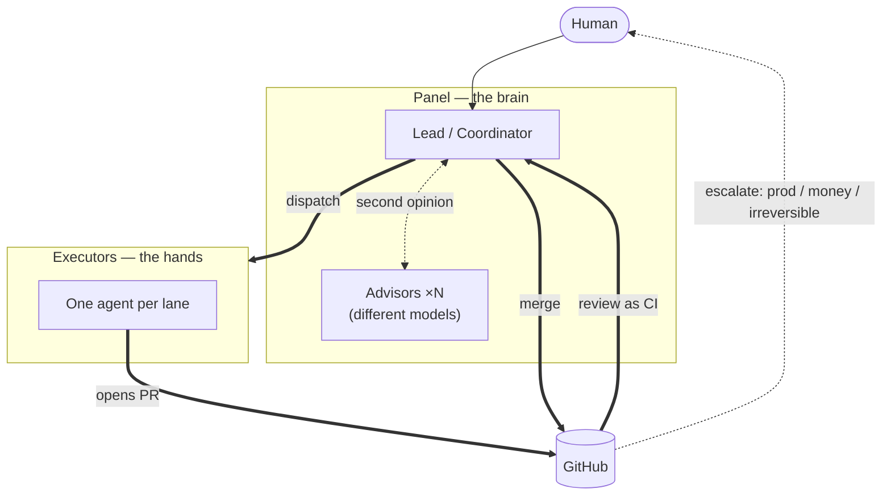
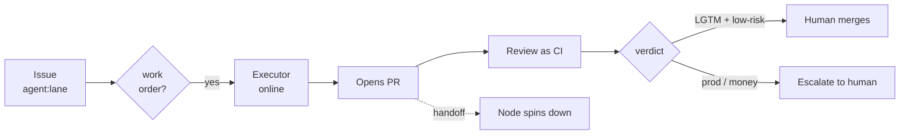

# flightdeck

> Running a fleet of AI agents in production — the human still lands the plane.

This is a field log of how I run a small fleet of AI coding agents: how they're
wired, how work gets dispatched, how they review each other, and where I — a
human — stay in the loop. It's not a framework and it's not a product. It's the
setup I actually use, written down so it's less of a black box.

Everything here is described at the level of **roles and mechanisms**. Machine
names, credentials, and private repositories are deliberately left out (see
[What's not here](#whats-not-here)).

---

## Real talk

There's almost nothing original in here. Most of it is stuff I copied from other
people and then bent into a shape that fits my hands. I've tried to credit the
sources I remember, but I've definitely missed some — not out of disrespect, I
just can't recall them all.

If you think a pattern here started with you, open a PR and I'll add the credit.
For any code I copied wholesale, I'll do my best to link the original and its
license.

The parts that might be mine aren't the components — everyone can wire up the
same building blocks. It's how they're bolted together. That's the only thing
worth reading this for.

---

## The big picture

Two layers: a **panel** that thinks, and a set of **hands** that build. A human
sits above both and lands the plane.

The rest of this doc breaks that picture down block by block.

---

## The panel — the brain

A coordinator plus a few advisors, each backed by a **different** model. Using
different models is the whole point: one model's confident mistake is another
model's obvious catch.

- **Lead / Coordinator** — the single point of contact. Plans, dispatches work,
  reviews pull requests, makes the final call.
- **Advisors (×N)** — pulled in on demand for a second opinion on architecture,
  risky changes, or "is this bug/finding actually real?" They argue; they don't
  act. The Lead synthesizes and decides.

Roles, not personalities. Any model can back any role.

---

## The executors — the hands

One agent per **lane** (a domain of work). Each runs on an elastic cloud node,
is scoped to its lane and nothing else, and actually writes and pushes code.
Add capacity by adding lanes, not by cloning one agent.

---

## How work flows

Work orders are **GitHub issues**, and the lifecycle is **label-driven**.

1. An issue labelled for a lane means "there is work here."
2. **Ground control** (next section) brings exactly one executor online.
3. The executor does the work and opens a **pull request**.
4. On handoff the label flips to a review state and the node spins down.
5. The Lead reviews; green + low-risk merges, the rest escalates to me.

### PR review as CI

The moment a PR is marked ready for review, an **automated review runs as a CI
check**. On later pushes it doesn't fire immediately — a scheduled job re-checks
every few minutes and only starts a fresh review if something changed. The cron
isn't guaranteed to the minute, but the upside is a genuinely useful gate
**without standing compute** burning money.

Each review posts one **aggregated comment** with a red/yellow/green verdict,
minimizes the now-stale previous comments, and reports a **last-commit status** —
so the CI panel simply shows the PR as *review failed* or *LGTM*. When I wake up
to an LGTM I still read it myself before merging. The bot narrows what I look
at; it doesn't replace the look.

---

## Ground control

Executors aren't kept alive by uptime — they're dispatched on demand and towed
when they get stuck. Three layers keep the fleet honest:

- **Self-dispatch** — a stateless reconcile loop sets each lane's desired count
  from one question: *is there an open work order for this lane?* No order →
  zero instances. You pay only for aircraft that are actually flying.
- **Recovery** — a per-container watchdog notices a hung task (local progress
  stops advancing past a threshold), wraps up the work, and recycles it. A task
  that runs too long gets bounced back for splitting instead of burning forever.
- **The tower** — a platform health check catches the case where the watchdog
  itself dies, and swaps the task out.

---

## The black box

Every scar in here changed the design. A few lessons that generalize past my
setup:

**Liveness ≠ progress.** My first stuck-detector asked "how long has this been
running?" and cheerfully killed healthy long jobs. The fix — and the shape of
Ground control — is to watch *whether work is still advancing* (are the progress
files changing?), not how long the clock has run. Uptime is not health.

**Serverless memory is a lie across invocations.** A reconcile timer I kept in a
function's memory got silently reset every time the platform rotated to a fresh
execution environment — the countdown never finished. Anything a serverless
function must remember *between* calls has to live in external state. In-memory
is per-invocation, no matter how the code reads.

**Deleting a component doesn't delete its job.** I removed one background waker,
and the conditions it used to watch for simply… stopped being watched. Work that
needed a nudge just sat there. When you retire a piece, its responsibilities
don't evaporate — someone has to inherit them explicitly, or they become a
silent hole.

**Detail ≠ correct.** An agent once probed a registry, saw a few tags, and
confidently concluded the wrong thing — contradicting the official docs, which it
never opened. The more specific and fluent a wrong answer sounds, the more it
gets believed. For anything you can't fully observe, trust the source of truth
over a handful of confident samples.

---

## Second opinion is a hard rule

For anything that matters — a design call, a code review, an architecture change
— I don't let a single model be the only one that thought about it. The diff or
the direction goes in front of the advisors, each a different model, and they
come at it from different angles before I converge. Only the trivial, low-risk
stuff goes solo.

Multi-model isn't for consensus. It's so *I* can make the call with more of the
failure modes surfaced.

---

## Where the human stays in the loop

The agents are trusted with a lot, but the plane is landed by a person. Three
things stay firmly on my side of the line:

- **Production, real users, real money** — final merge is mine.
- **The irreversible** — deleting data, force-pushing shared branches, retiring
  resources, making something public.
- **Strategy and product direction** — what to build, whether to build it.

Everything reversible and routine, the fleet just does, and tells me after.

---

## Security posture (mechanism, not secrets)

- Resource access uses **OIDC federation** for short-lived credentials. A
  long-lived static access key is treated as a red flag.
- The few real secrets live in a **central secret store** and are resolved into
  memory at boot — never written to disk, env, or logs.
- Agent-to-agent handoff is an explicit trust relationship, not an open door.
- An agent's **environment is an attack surface**. Anything sitting in its env
  vars can be coaxed out by prompt injection, so real secrets never ride in the
  environment — they're read from a controlled store at the moment of use.

No keys, ARNs, account IDs, hostnames, or paths appear anywhere in this repo.

---

## What's not here

This repo documents *how the fleet is organized*, not *the instance I run*.
Deliberately absent:

- machine names, IPs, network topology
- credentials, tokens, secret locations, cloud account identifiers
- private repository names (referred to by their nature instead)

The building blocks are named freely — the stack isn't the secret. The keys and
the door numbers are.

---

## Credits / prior art

This stands on a lot of shoulders. Non-exhaustive, and if you're missing from it
that's a PR, not an argument — I'll add you.

- **[openab](https://github.com/openabdev/openab)** — the open-source project the
  whole fleet runs on. None of this exists without it. Huge shout-out to the
  project and everyone building it.
- **Special thanks to Pahud** — for explaining the PR-review-as-CI pattern
  (aggregated red/yellow/green verdict, scheduled re-check, no standing compute)
  that the review flow here is built on.

---

*Notes from the flight deck. Corrections welcome; credits especially welcome.*
