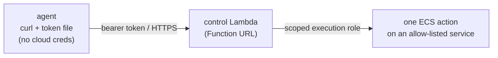

# The control bridge

How an agent reaches into the cloud to start and stop its own fleet — **without
ever holding a cloud credential**. This is the piece that lets an untrusted,
model-driven process operate real infrastructure with a blast radius you can
write down on one line.

## The one idea

An agent runs model-generated commands and reads untrusted input, so it's a
prompt-injection target. Design backwards from *"assume it's already
compromised"*: **it must never hold a credential that can do more than the one
thing it's allowed to do.**

So the agent holds no cloud keys at all. It holds a single bearer token that can
call exactly one narrow function. That function holds the (scoped) permission and
does the actual work.

## The shape

- The **agent** has `curl` and a token in a file. No cloud SDK, no access key,
  nothing else. That's the whole client.
- A **control Lambda** sits behind a Function URL. The bearer token authenticates
  the call; the Lambda does one job — start / stop / status of a service it
  manages.
- The Lambda's **IAM role** — not the agent — carries the cloud permission, and
  that permission is scoped to the bone (below).

Three checks stack: the **token** (can you call the function at all?), the
**Lambda's own logic** (is this a start/stop/status for a service it manages?),
and the **role** (can the function's identity even perform this action, on this
resource?). Peel any one and the others still hold.

## The skill (agent side)

On the agent, "control the fleet" is a thin shell script — a few `curl` calls to
the Function URL carrying the token:

- `status` — is the service up?
- `start` / `stop` — set its desired count to one / zero.

Two deliberate choices:

- **The token lives in a file, not an environment variable.** Anything in the
  environment can be coaxed out by prompt injection; a file read is a narrower
  surface. (Same reason real secrets never ride in env here.)
- **Guardrails in the skill are convenience, not security.** A helper can refuse
  an obviously dangerous action — but the skill runs *on the agent*, and the
  agent is the untrusted part. A compromised agent can simply skip the check. So
  skill-side guardrails exist to stop honest mistakes; the real enforcement is
  server-side.

That second point is the whole game: **never trust the client for security when
the client is the thing you're worried about.**

## The Lambda's role (least privilege)

This is where the actual boundary lives. The Lambda's execution role can do only:

- a **specific action or two** — set a service's desired count, describe a
  service —
- on an **allow-list of exactly the service ARNs** it manages — never `*`.

Nothing else. No read of other services, no other API, no wildcard resource.
Bringing a new service under control means adding its ARN to that allow-list — an
explicit, reviewable change, not an automatic grant.

And the role uses the Lambda's own temporary execution credentials, so there's no
long-lived access key anywhere in the path — not on the agent, not in the
function.

## Blast radius

Write down what a *fully compromised* agent can do with everything it holds:

- It has a token to one Function URL → it can call that one Lambda.
- That Lambda can start / stop / describe a fixed allow-list of services → the
  worst it can do is start or stop those specific services.
- It cannot read a secret, reach another service, escalate, or touch any other
  corner of the account — because it never had a credential that could.

That's the point of the arrangement: the ceiling is small, fixed, and written
down. You don't have to trust the agent; you've *bounded* it.

## What this gives up

It's more moving parts than handing the agent a broad role directly, and every
new capability is a new narrow endpoint plus an allow-list edit. That friction is
the feature — it forces each new power the agent gains to be a deliberate,
scoped, reviewable step instead of a quiet privilege creep.

---

*Part of [flightdeck](../README.md). Corrections welcome.*
