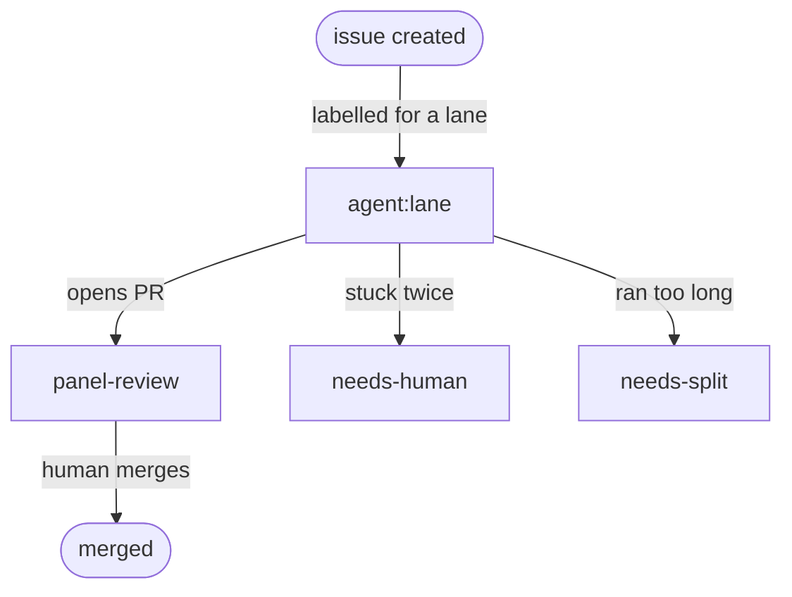

# The dispatch lifecycle

How a piece of work travels from "someone should do this" to "merged" — without
a human babysitting the executors in between. This is the part people ask about
most, so it gets the most detail.

The whole thing runs on one idea: **an executor is not a server you keep alive.
It's a short-lived instance you bring into existence when there's work, and let
disappear when there isn't.** Its identity is the *lane* it serves, not a
machine — there's no long-lived box to point at. Everything below falls out of
that.

---

## The state machine

Work is tracked by **labels on a GitHub issue**. The label *is* the control-plane
state — whether an executor should exist — with no separate database of who's
doing what. (The executor has its own runtime state while it works; the labels
don't try to capture that, only whether one should be up.)

Two transitions loop back to `agent:<lane>` and are left off the diagram to keep
it clean: a PR sent back with **changes requested**, and a **needs-split** issue
re-entering as smaller orders.

- `agent:<lane>` — there is open work for this lane. **An executor should exist.**
- `panel-review` — the executor handed off a PR. **The executor is done; no
  container needs to be running.**
- `needs-human` — something went wrong twice; a person should look.
- `needs-split` — the work was too big for one pass; break it up.

Read the labels and you know the control-plane state of the fleet — who should be
up, who's waiting, who's stuck. That's deliberate: the source of truth is public
and boring, not a clever in-memory scheduler.

---

## 1. Work orders are issues

A unit of work is a GitHub issue labelled for a lane. No label, no work. This
means dispatching work is just… labelling an issue — something a human or an
agent can do from anywhere, with no special client.

## 2. Ground control brings an executor online

Nothing polls "is there work?" on a running box. Instead a small **reconcile
loop** (a function on a one-minute schedule) applies one rule per lane:

> Is there an open `agent:<lane>` issue? → desired count **one**. Otherwise →
> **zero**.

That's the whole autoscaler — desired count as a function of the open work
orders. It's **one executor per lane, not one per issue**: several open orders
for the same lane still mean a single instance, working them in turn. The rule is
deliberately simple — it's the current policy, not a law of physics — and you pay
only for executors that have something to do.

## 3. The executor works and opens a PR

The executor is scoped to its lane. It picks up the issue, does the work, and
opens a pull request. It writes and pushes code; it does not merge.

## 4. Handoff: relabel, then spin down

When the PR is up, the label flips from `agent:<lane>` to `panel-review`. That
relabel is the signal that means **"I'm done — you can stop paying for me."** On
its next pass the reconcile loop sees no open `agent:<lane>` issue for that lane
and scales the executor to zero. Handoff isn't a shutdown call — it's a label
change that lets the *next* reconcile tick do the shutting down.

## 5. Review and the human gate

The Lead reviews the PR — the panel described in the [README](../README.md).
Green and low-risk gets merged; anything touching production, money, or the irreversible escalates to a
human. Changes-requested flips the label back to `agent:<lane>` — which, by the
same reconcile rule, brings the executor back to fix it.

---

## Ground control internals

"Bring one up when there's work" is the happy path. Most of the design is about
the unhappy paths — an executor that hangs, or runs forever, or dies. Three
layers:

- **Self-dispatch** — the reconcile loop above. Stateless: it re-derives desired
  count from the labels every minute, so it can't drift out of sync with reality.
- **Recovery** — each executor runs a watchdog with *two separate clocks*. The
  **progress clock** asks "is work still advancing?" (are the on-disk progress
  files still changing?) — if it stalls past a threshold, the watchdog wraps up,
  leaves a note on the issue, and recycles. The **duration clock** asks "has this
  one task simply run too long?" regardless of progress — if so it's bounced to
  `needs-split` instead of burning forever. Two failed recoveries in a row →
  `needs-human`, so a stuck job can't loop on the meter.
- **The tower** — the platform's own health check. If the watchdog itself dies,
  the platform notices the heartbeat stop and swaps the task out. Someone always
  watches the watcher.

The reason recovery watches *progress* and not *uptime* is a scar — see
[the lessons](#the-scars-that-shaped-this).

---

## Other ways to wire the same idea

Label-driven scale-to-zero isn't the only shape. A couple of variants (thanks to
[Pahud](https://github.com/pahud), who sketched these):

- **Metric-driven** — every minute, publish the open-order *count* as a metric
  (`0 0 1 2 2 1 0 …`) and let the platform's own autoscaler bring the service up
  while the count is above zero and back down when it hits zero. Passive rather
  than active, same outcome.
- **Board-driven** — route new issues and PRs onto a project board; a card
  landing in an *incoming* column is the signal to scale up, and an empty column
  scales back down. The board doubles as a visible queue you can watch move.

This repo runs the reconcile-loop version above, but any of these gets you the
"pay only when there's work" property.

---

## The scars that shaped this

Three things broke before the design settled. Each one is why a piece is shaped
the way it is.

**Uptime is not health.** The first stuck-detector killed executors that had
simply been running a while — including healthy long jobs. Recovery now watches
whether progress files are still moving, not how long the clock has run.

**A serverless timer has no memory.** An early version of the reconcile loop kept
a countdown in the function's memory. The platform rotated execution environments
underneath it and the countdown silently reset every time — it never fired. The
reconcile loop is now stateless and re-derives everything from the labels each
run. Anything a serverless function must remember between calls lives in external
state, never in memory.

**Deleting a component doesn't delete its job.** An earlier background waker
watched for a couple of conditions (a fresh human comment, an unanswered review).
When it was removed, those conditions just… stopped being watched, and work that
needed a nudge sat there. Its responsibilities had to be explicitly inherited by
the reconcile loop. When you retire a piece, hand off what it was quietly doing —
or it becomes a silent hole.

---

*Part of [flightdeck](../README.md). Corrections welcome.*
