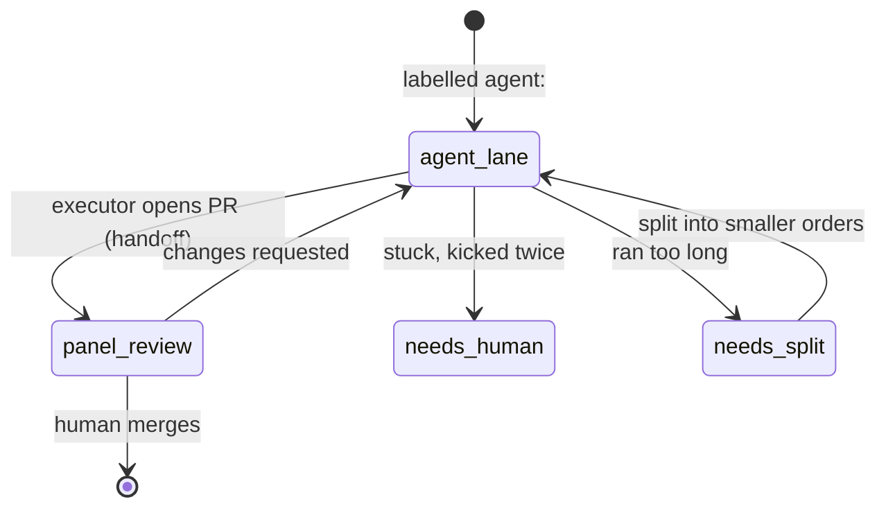

# The dispatch lifecycle

How a piece of work travels from "someone should do this" to "merged" — without
a human babysitting the executors in between. This is the part people ask about
most, so it gets the most detail.

The whole thing runs on one idea: **an executor is not a server you keep alive.
It's a thing you bring into existence when there's work, and let disappear when
there isn't.** Everything below falls out of that.

---

## The state machine

Work is tracked by **labels on a GitHub issue**. The label *is* the state — there
is no separate database of who's doing what.

- `agent:<lane>` — there is open work for this lane. **An executor should exist.**
- `panel-review` — the executor handed off a PR. **The executor is done; no
  container needs to be running.**
- `needs-human` — something went wrong twice; a person should look.
- `needs-split` — the work was too big for one pass; break it up.

Read the labels and you know the exact state of the fleet. That's deliberate:
the source of truth is public and boring, not a clever in-memory scheduler.

---

## 1. Work orders are issues

A unit of work is a GitHub issue labelled for a lane. No label, no work. This
means dispatching work is just… labelling an issue — something a human or an
agent can do from anywhere, with no special client.

## 2. Ground control brings an executor online

Nothing polls "is there work?" on a running box. Instead a small **reconcile
loop** (a function on a one-minute schedule) answers one question per lane:

> Is there an open `agent:<lane>` issue? → run **one** executor. Otherwise →
> run **zero**.

That's the entire autoscaler. The desired count is a pure function of the open
work orders. You pay only for executors that have something to do.

## 3. The executor works and opens a PR

The executor is scoped to its lane. It picks up the issue, does the work, and
opens a pull request. It writes and pushes code; it does not merge.

## 4. Handoff: relabel, then spin down

When the PR is up, the label flips from `agent:<lane>` to `panel-review`. That
relabel is the signal that means **"I'm done — you can stop paying for me."** The
reconcile loop sees no open `agent:<lane>` issue and scales the executor back to
zero. Handoff and shutdown are the same event.

## 5. Review and the human gate

The Lead reviews the PR — the panel described in the [README](../README.md).
Green and low-risk gets merged; anything touching production, money, or the irreversible escalates to a
human. Changes-requested flips the label back to `agent:<lane>` — which, by the
same reconcile rule, brings the executor back to fix it.

---

## Ground control internals

"Bring one up when there's work" is the happy path. Most of the design is about
the unhappy paths — an executor that hangs, or runs forever, or dies. Three
layers:

- **Self-dispatch** — the reconcile loop above. Stateless: it re-derives desired
  count from the labels every minute, so it can't drift out of sync with reality.
- **Recovery** — each executor runs a watchdog. It watches whether *work is
  advancing* (are the on-disk progress files still changing?). If progress stalls
  past a threshold, it wraps up, leaves a note on the issue, and recycles. If a
  task runs far too long, it gets bounced to `needs-split` instead of burning
  forever. Two failed recoveries in a row → `needs-human`, so a stuck job can't
  loop on the meter.
- **The tower** — the platform's own health check. If the watchdog itself dies,
  the platform notices the heartbeat stop and swaps the task out. Someone always
  watches the watcher.

The reason recovery watches *progress* and not *uptime* is a scar — see
[the lessons](#the-scars-that-shaped-this).

---

## The scars that shaped this

Three things broke before the design settled. Each one is why a piece is shaped
the way it is.

**Uptime is not health.** The first stuck-detector killed executors that had
simply been running a while — including healthy long jobs. Recovery now watches
whether progress files are still moving, not how long the clock has run.

**A serverless timer has no memory.** An early version of the reconcile loop kept
a countdown in the function's memory. The platform rotated execution environments
underneath it and the countdown silently reset every time — it never fired. The
reconcile loop is now stateless and re-derives everything from the labels each
run. Anything a serverless function must remember between calls lives in external
state, never in memory.

**Deleting a component doesn't delete its job.** An earlier background waker
watched for a couple of conditions (a fresh human comment, an unanswered review).
When it was removed, those conditions just… stopped being watched, and work that
needed a nudge sat there. Its responsibilities had to be explicitly inherited by
the reconcile loop. When you retire a piece, hand off what it was quietly doing —
or it becomes a silent hole.

---

*Part of [flightdeck](../README.md). Corrections welcome.*
