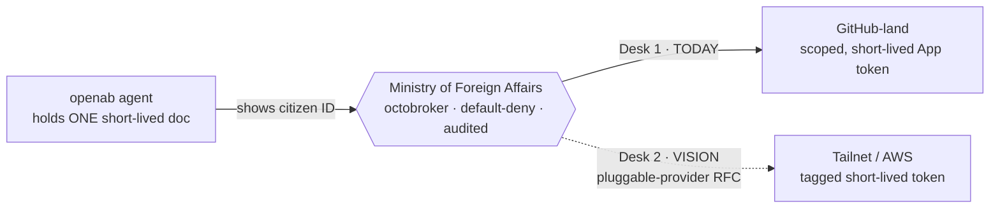
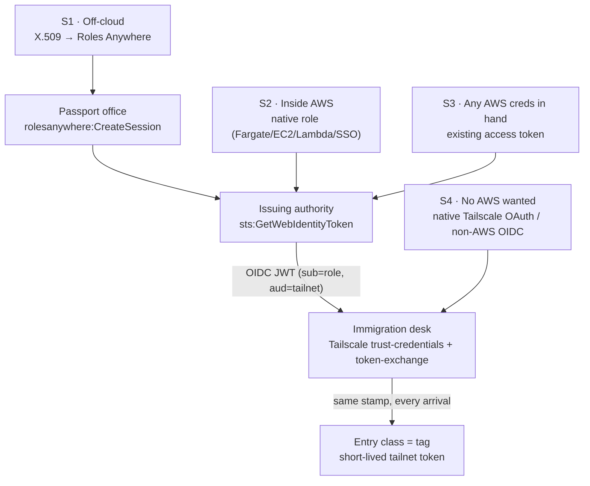
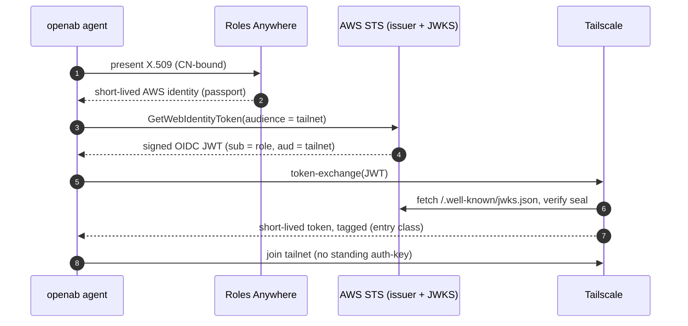

# One Ministry, Many Borders
### The openab fleet's foreign policy — agents carry one short-lived document; a single ministry clears them into every service on visa-waiver
*(Target-state doctrine. Today's reality is **split** across several controls — an SSM/KMS scoped vault, Roles Anywhere identities, and octobroker as a GitHub-only sibling. The single unified broker is **not shipped**; see the status note below.)*

> **Bottom line:** an openab agent holds **one short-lived document** and nothing else — no long-lived AWS key, no standing tailnet auth-key, no GitHub PAT. Every border runs on **visa-waiver**: present a trusted, government-verifiable document, receive a **time-boxed entry stamp on arrival**, walk in. The stamp self-expires. Nothing to hoard, leak, or revoke by hand.

> **Precise scope of "keyless."** It means **no long-lived shared secret in the app/runtime** — no static access key, auth-key, or PAT in the container. It does **not** mean trust comes from nowhere: the chain still stands on an **X.509 trust anchor**, **IAM role trust policies**, **KMS key policies**, and **broker/tailnet config** — the durable controls that make the short-lived tokens safe. The win is that *the thing sitting in the agent* is short-lived and scoped. (A stricter label would be **"long-lived-secretless."**)

**How to read this note.** Claims are tagged **[Today]**, **[Proposed]** (RFC `openabdev/octobroker#54`), or **[Vision]** so roadmap is never mistaken for shipped fact. Every metaphor lands back on mechanics — who signs, who verifies, who authorizes, token lifetime, blast radius — via the leg descriptions (§2), the **runbook** (§9), and the **decoder ring** (§10), where every metaphor maps to a named, auditable component.

**Contents**
1. Doctrine — no bribes at the border
2. The border protocol (Legs A–C): passport → travel document → entry stamp
3. Ways to arrive — the traveller's document is pluggable (4 scenarios + Mermaid)
4. The scoped vault — SSM SecureString + scoped role (does it sharpen issuance?)
5. My current setup — one working Roles Anywhere architecture
6. octobroker — the Ministry of Foreign Affairs (Today / Proposed / Vision)
7. Sequence diagram — one clearance, end to end
8. Why we fly this way
9. Runbook & NOTAMs
10. Decoder ring

---

> **Where openab actually stands today (honest status — read this first).** openab does **not** currently run on octobroker. Its broker surface carries **many** secret/identity types — GitHub App private keys, Tailscale client credentials, AWS identities, service keys — **not just GitHub tokens**, so a GitHub-only broker isn't a drop-in. Today openab implements the *spirit* itself: a **scoped SSM vault** (per-App CMK + per-principal KMS + audit, §4) plus **Roles Anywhere** identities (§5). The **unified ministry** in this note — one ID, one broker for every border — is **[Vision]**, an open design direction, not a shipped state. What makes it plausible is octobroker's **pluggable-provider** refactor (RFC `openabdev/octobroker#54`): if the broker becomes provider-agnostic, a **Roles Anywhere / workload-identity provider** could sit beside GitHub and carry openab's broader secret surface. This is a thesis openab is *thinking through* — offered here to align with octobroker's spirit and invite scrutiny, not as a committed roadmap.

## 1. Doctrine — no bribes at the border

The old way to put a machine into AWS was to staple a **long-lived access key** to it — cash taped inside a passport. It never expires, it gets photographed, it drops out in a git commit, and when it's stolen you can't tell which traveller lost it. Same for a static **Tailscale auth-key** or a **GitHub PAT** baked into an agent container.

openab's rule: **agents carry no long-lived credentials.** Every border runs on **visa-waiver** — a trusted document in, a time-boxed stamp out. The endgame: **one ministry** does all the paperwork, so a traveller shows **one citizen ID** and is cleared into GitHub-land, the tailnet, and AWS alike.



---

## 2. The border protocol (Legs A–C)

This is the paperwork for the **tailnet/AWS** border. Today it's a manual sequence (§9); the ministry's future Desk 2 would run it for you.

**Leg A — the passport office (IAM Roles Anywhere).** You don't hand the border cash; you prove citizenship. Your **civil registry** is your own private CA, whose seal AWS keeps as a **trust anchor**. The traveller presents a **birth certificate** — a short-lived **X.509 cert** (private key ideally TPM-sealed) — and `aws_signing_helper` → `rolesanywhere:CreateSession` issues a **passport = short-lived AWS identity**. The passport's name page is the cert's **Common Name**.

**Leg B — the issuing authority (STS `GetWebIdentityToken`).** The old lore — *"AWS won't issue internationally-recognised travel documents, run your own passport shop"* (self-hosted KMS/Lambda OIDC broker) — is **obsolete as of 2025**. AWS STS is now a recognised issuer (**Outbound Identity Federation**): enable it once and your account gets a unique **issuer URL** with a **public seal registry** (`/.well-known/openid-configuration` + `/jwks.json`). A passport-holder calls `sts:GetWebIdentityToken --audience …` and receives a **signed OIDC JWT** whose chip reads *holder = this role, bound for = the tailnet*. The signing key never leaves AWS's HSM.

**Leg C — immigration & the visa-waiver (Tailscale WIF).** Your tailnet has signed a **visa-waiver treaty** at **trust-credentials**: *"we recognise documents from issuer X; if holder = role Y bound for us, wave them through as class Z."* Tailscale's **token-exchange** officer fetches your JWKS, verifies the seal, matches `sub`/`aud`, and stamps an **entry class = a tag** with a **short-lived tailnet token**. No standing visa was ever filed.

---

## 3. Ways to arrive — the traveller's document is pluggable

The freeing part: **the immigration desk never changes.** The treaty, the officer, the entry stamp (the **tag**) are identical no matter how the traveller showed up. Only the **document in hand at the issuing counter** differs. Swapping it is swapping a **`CredentialBackend`** — which is exactly what RFC `openabdev/octobroker#54` makes pluggable.



- **S1 · The diplomatic passport (IAM Roles Anywhere).** *House favourite.* Traveller lives **off-cloud** (on-prem NUC, edge box, another cloud). Presents X.509 from your own CA. The only arrival that is keyless **and** works **anywhere** **and** binds to hardware you control — see §5 for one working setup. **[Today]**
- **S2 · The local-province passport (AWS-native identity).** Traveller **already inside AWS** — Fargate task role, EC2 instance profile, Lambda role, SSO. Skips the passport office; walks straight to the issuing counter. Fewest moving parts; often the shortest runway for openab's own Fargate crews. **[Today]**
- **S3 · A valid token already in hand (any AWS creds).** Any SigV4-signable principal can request a travel document — assumed-role creds, an SSO token, even a legacy static key you're migrating off. Best as a **transition**. **[Today]**
- **S4 · Arrive straight at immigration (skip AWS).** Tailscale honours its **own** documents — native OAuth client / auth-key — or a visa-waiver with a **non-AWS** government (GitHub Actions, GCP, Azure OIDC). No AWS detour. Trade-off: you give up the **AWS identity as a universal hub**. **[Today]**

| Traveller lives… | Document | CA? | AWS? | Keyless? | Desk + tag |
|---|---|---|---|---|---|
| Off-cloud | X.509 → Roles Anywhere *(S1 ★)* | yours | yes | ✔ | **identical** |
| Inside AWS | native AWS role *(S2)* | no | yes | ✔ | **identical** |
| Anywhere w/ AWS creds | existing token *(S3)* | no | yes | ✔/△ | **identical** |
| Anywhere, no AWS | Tailscale/non-AWS OIDC *(S4)* | no | no | ✔ | **identical** |

---

## 4. The scoped vault — SSM SecureString + scoped role

**Question (jonatw):** if SSM Parameter Store SecureString is a secret carrier, does pairing it with a **scoped role** give *finer, more dynamic* issuance? **Doc-confirmed answer, honestly bounded:**

- **✔ Finer scoping is real.** SSM SecureString is a **KMS-encrypted** carrier. With **path-based IAM** (`Resource: …:parameter/prefix-*`, `ssm:Recursive`) + a **per-principal KMS grant**, each principal decrypts **only its own slice**. Reading needs both `ssm:GetParameter*` **and** `kms:Decrypt` on the right key — two locks, per principal.
- **⚠️ "Dynamic" needs a caveat.** Parameter Store has **no native rotation** (that's Secrets Manager). Its dynamic levers are **parameter policies** — `Expiration`/TTL + EventBridge notifications (Advanced tier) — and **versioning**. So it's a **scoped, TTL-capable, auditable *static carrier*,** not a rotation engine.
- **🔗 How it sharpens *issuance*.** Put the mint-time inputs (audience / Tailscale client-id / tailnet config) behind scoped SSM paths, and *"which token a role may mint"* becomes *"which SSM path it may decrypt."* That's **scoped minting authority + TTL'd config + full audit** — the finer-grained control is genuine. The truly ephemeral part (the JWT, the tailnet token) still comes from STS/Tailscale, which are short-lived by construction.

**openab has deployed a hardened variant — `SsmSecurityStack` (#97):** it provisions **per-App customer-managed KMS keys** (replacing the default SSM key), grants each agent task role `kms:Decrypt` on **only its own** key, and wires **EventBridge + SNS** alerts on any read of the GitHub App-key parameters by a non-agent-role principal (`anything-but` the legit role ARNs). That's the scoped-vault shape — per-secret KMS isolation + least-privilege + audit — reusable to gate mint-time inputs. *(Stack deployed; exact secret storage paths omitted for this public copy.)* **[Today]**

> Fits openab's standing preference: **SSM SecureString over Secrets Manager** — cheaper, KMS-isolated, path-scoped, audited; accept "no native rotation" as the trade and let STS/Tailscale supply the short-lived tokens.

---

## 5. My current setup — one working Roles Anywhere architecture

**This is my own current architecture, not an openab-official standard** — treat it as *a* working reference, not *the* prescribed way. Scenario 1 as I run it in `EagleReadonlyStack` (#174): the N200 panel-lead's read-only AWS telescope, which **doubles as the tailnet-minting identity**:

- **Self-managed fleet CA.** Private key is **cold-stored offline** (not in any repo); only the **public CA cert** is registered as a `CERTIFICATE_BUNDLE` **trust anchor**.
- **Leaf cert:** `CN=eagle-n200`, ~90-day validity, on the N200 host. Key never leaves it.
- **Role trust bound to the CN.** `aws:PrincipalTag/x509Subject/CN == eagle-n200` — the same CA signing *another* leaf can't map into this role. Plus `sts:TagSession` + `sts:SetSourceIdentity` for the Roles Anywhere session tags.
- **Permissions:** `ViewOnlyAccess` baseline + named diagnostics (CloudTrail LookupEvents, Logs read, Cost Explorer read, Batch describe).
- **DENY-5 (read-only, no secrets, no pivot):** `ssm:GetParameter*`, `secretsmanager:GetSecretValue`, `kms:Decrypt`, `s3:GetObject`, `sts:AssumeRole*`.
- **The tailnet grant lives on this role:** `sts:GetWebIdentityToken`. **NOTAM:** this API is **outside the `AssumeRole*` family**, so DENY-5's `sts:AssumeRole*` deny does **not** block it — that's deliberate, but it means the permission must be reviewed on its own.
- **Profile:** 1-hour sessions. **Renewal:** a daily countdown cron flags the leaf's expiry. **Revocation:** disable/delete the trust anchor and every leaf dies at once.

```python
# EagleReadonlyStack (trimmed; account/ARNs redacted for this public copy)
anchor = ra.CfnTrustAnchor(self, "FleetCaAnchor", name="openab-fleet-ca", enabled=True,
    source=ra.CfnTrustAnchor.SourceProperty(
        source_type="CERTIFICATE_BUNDLE",
        source_data=ra.CfnTrustAnchor.SourceDataProperty(x509_certificate_data=FLEET_CA_PEM)))

cn = {"StringEquals": {"aws:PrincipalTag/x509Subject/CN": "eagle-n200"}}
role = iam.Role(self, "EagleReadonly", role_name="openab-eagle-readonly",
    assumed_by=iam.PrincipalWithConditions(iam.ServicePrincipal("rolesanywhere.amazonaws.com"), cn),
    managed_policies=[iam.ManagedPolicy.from_aws_managed_policy_name("job-function/ViewOnlyAccess")])
role.assume_role_policy.add_statements(iam.PolicyStatement(
    actions=["sts:TagSession", "sts:SetSourceIdentity"],
    principals=[iam.ServicePrincipal("rolesanywhere.amazonaws.com")], conditions=cn))

role.add_to_policy(iam.PolicyStatement(sid="TailscaleWIF",
    actions=["sts:GetWebIdentityToken"], resources=[f"arn:aws:sts::{self.account}:self"]))  # mint only for self

role.add_to_policy(iam.PolicyStatement(sid="DenySecretsAndPivot", effect=iam.Effect.DENY,
    actions=["ssm:GetParameter","ssm:GetParameters","ssm:GetParametersByPath",
             "secretsmanager:GetSecretValue","kms:Decrypt","s3:GetObject",
             "sts:AssumeRole","sts:AssumeRoleWithSAML","sts:AssumeRoleWithWebIdentity"],
    resources=["*"]))

profile = ra.CfnProfile(self, "EagleProfile", name="openab-eagle-readonly",
    enabled=True, duration_seconds=3600, role_arns=[role.role_arn])
```

> **NOTAM (field-verified):** the audience/duration IAM condition keys (`sts:IdentityTokenAudience`, `sts:DurationSeconds`) were **not present in this API's request context** when flown — a condition lock on them fails **closed**. Until AWS ships them, bound the risk with `resource: sts::<account>:self` + a **single-purpose role**. Residual-exposure notes tracked privately, not here.

---

## 6. octobroker — the Ministry of Foreign Affairs

- **[Today]** octobroker runs the **GitHub-land** border. Traveller shows a **citizen ID** (`X-Octobroker-Key`) — all it carries — the ministry checks a **default-deny treaty-book** (which repos/tools) and issues a visa. Crucially, it does **not** hand over its own credential and it does **not** strip a broad token down: it **mints a fresh ~1-hour GitHub App installation token, already narrowed at mint time** to the **exact repositories** (via the API's `repositories` param) and a **minimal permission envelope** (a git-push credential gets only `contents:write` — no issues, PRs, Actions, or admin). **GitHub itself enforces both boundaries**, and MCP vs. git tokens are cache- and scope-isolated so a broader token can never satisfy a narrower request. The App private key never leaves the ministry; every issuance is **audit-logged**. The visa is stamped for specific cities and activities *before* it's handed over — no traveller holds a GitHub PAT. *(Verified against `openabdev/octobroker` `src/app_token.rs`.)*
- **[Proposed]** RFC `openabdev/octobroker#54` (pluggable provider abstraction, by antigenius0910, 2026-07-24) extracts three traits — **`CredentialBackend`** / **`UpstreamClient`** / **`PolicyClassifier`** — so GitHub becomes *the first* desk, not the only hardcoded one. Explicitly a **pure refactor, no new provider, no config change, byte-identical wire behaviour.** It ships the **hinges**, not a second border.
- **[Vision]** On those hinges, a **Tailnet/AWS desk** opens beside GitHub: a `CredentialBackend` that runs Legs A–C behind the **same** front counter (one citizen ID), **same** treaty-book (default-deny), **same** stamp log (audit). The fleet's foreign policy collapses to its ideal: **one ID, one ministry, every border on waiver.** **Important honesty:** openab has **not** adopted octobroker — its secret surface is broader than GitHub tokens (see the status note up top), so today it runs its **own** scoped vault + Roles Anywhere. This unified-ministry direction — pluggable broker (`#54`) + Roles Anywhere carrying the full secret surface — is an **open design thesis openab is exploring**, not a plan. The protocol in §2 works by hand today; a pluggable ministry is what *could* one day run it for you. **Cost of pluggability (honest):** every new provider is a new trust-critical surface — each `CredentialBackend` must inherit the *same* default-deny + audit invariants and be reviewed as carefully as the GitHub one. A pluggable broker multiplies the places a missed permission check becomes privilege escape; that review burden is the price of the design.

---

## 7. Sequence — one clearance, end to end



---

## 8. Why we fly this way
- **No bribes at the border** — zero long-lived AWS keys, tailnet auth-keys, or GitHub PATs in agent containers.
- **Documents, not secrets** — every credential short-lived, scoped, government-verifiable, auto-expiring.
- **Managed issuing authority** — AWS STS is the passport office *and* the seal registry; no self-run KMS/Lambda broker to babysit.
- **Scoped vault where secrets must persist** — SSM SecureString + per-principal KMS + audit (§4).
- **One ministry, one ID** — GitHub today, the tailnet/AWS desk on the roadmap (`openabdev/octobroker#54`).

---

## 9. Runbook & NOTAMs

*(A **[NOTAM](https://skybrary.aero/articles/notice-airmen-notam)** — Notice to Air Missions — is aviation's pre-flight bulletin of hazards and "sharp edges"; here it flags the operational gotchas before you fly this.)*

```bash
# One-time per account: turn STS into a recognised issuer
aws iam enable-outbound-web-identity-federation
aws iam get-outbound-web-identity-federation-info
#   → IssuerUrl  https://<unique-id>.tokens.sts.global.api.aws
#     discovery:  <IssuerUrl>/.well-known/openid-configuration   jwks: <IssuerUrl>/.well-known/jwks.json

# Traveller: passport → travel document → entry stamp
#   (already holding an AWS identity via S1/S2/S3)
export AWS_STS_REGIONAL_ENDPOINTS=regional      # GetWebIdentityToken is NOT on the STS global endpoint (else InvalidAction)
aws sts get-web-identity-token \
  --audience "api.tailscale.com/<client-id>" \
  --query WebIdentityToken --output text > travel.jwt   # sub=<role ARN>, aud=<tailnet>

# Exchange the JWT for a short-lived, tagged tailnet token
curl -s https://api.tailscale.com/api/v2/oauth/token-exchange \
  -d grant_type=urn:ietf:params:oauth:grant-type:token-exchange \
  -d subject_token="$(cat travel.jwt)" \
  -d subject_token_type=urn:ietf:params:oauth:token-type:jwt

# — OR, on Tailscale client v1.90.1+, skip the manual exchange and join directly —
tailscale up --client-id="<client-id>" --id-token="$(cat travel.jwt)" --advertise-tags="tag:openab-agent"
```

**Immigration desk (Tailscale trust-credentials):** register a federated identity — `Issuer` = your account IssuerUrl, `Audience` = `api.tailscale.com/<client-id>`, `Subject` = the exact role ARN (no loose wildcards), assign `Tags` + minimal `Scopes`.

**NOTAMs:** `GetWebIdentityToken` sits **outside** `AssumeRole*` (a `Deny AssumeRole*` guard misses it — review separately). The issuing counter is **regional** — the STS *global* endpoint returns `InvalidAction`; call a regional endpoint or set `AWS_STS_REGIONAL_ENDPOINTS=regional`. Audience/duration condition keys not yet in request context → scope by single-purpose role + `resource: self`. Pin `Subject` to the precise role ARN; hand out the narrowest tag/scope.

**Blast radius & residual risk (honest — from adversarial review).**
- **CA private-key compromise is the sharpest risk.** The Roles Anywhere trust anchor is the root of S1: if the fleet CA private key leaks, an attacker signs an X.509 with `CN=eagle-n200` and impersonates the role — **CN-binding does not stop a CA-key holder** (they simply forge the CN). Mitigation in place: the CA key is **cold-stored offline** (never in a repo or on a networked host). Stronger still: an **HSM**. Contain with **short-lived leaves** + immediate **trust-anchor disable/delete** on suspicion (kills every leaf at once).
  - **Hardening option (evaluated).** Back the CA with an **AWS KMS asymmetric key** (~$1/month): the signing key lives in a FIPS 140-2 L3 **HSM and is non-exportable** — there is **no key file to steal**, so this risk largely dissolves. Compromise then requires IAM `kms:Sign` access, which is **CloudTrail-audited and IAM-revocable** — a stronger posture than a cold-stored file, and ~400× cheaper than AWS Private CA (~$400/mo). Tools like `step-ca` support a KMS signer directly (an IAM role with `kms:GetPublicKey` + `kms:Sign` on the CA key). **Trade-off (known):** still **no real-time revocation of individual leaves** — but that's a Roles Anywhere limitation regardless (it honours *imported CRLs only*; no OCSP/CDP callbacks), so lean on **short-lived leaves** for passive revocation and kill the whole CA instantly by disabling the KMS key or the trust anchor.
- **Bearer-token replay window.** The JWT and the tailnet token are bearer credentials — an intercepted, un-expired one is usable until it expires. Keep both lifetimes minimal. *Caveat:* the IAM lever to **enforce** a short cap (`sts:DurationSeconds`) is **not yet available** (see NOTAMs); today the cap is procedural (single-purpose role), not policy-enforced.
- **Audience-lock gap.** Until the audience condition key ships, the minting role may request a token for **any** `aud`. Bound it with `resource: sts::<acct>:self` + a single-purpose role, and use **one minting role per audience/tailnet** — never share it. Pin Tailscale's `Subject` match to the exact role ARN so a reused ARN can't cross tailnets.
- **Tag scope.** A tailnet **tag is a door** — keep it minimal (`tag:openab-agent-ro`, not `tag:prod-*`); an over-broad tag spreads privilege past the token's intent.
- **Trust assumption (accepted, not mitigated here).** Verification rests on AWS's HTTPS-served JWKS being authentic — the standard OIDC trust root. JWKS-endpoint compromise or key-rotation lag is an AWS-managed risk, called out for honesty, not something this design removes.

---

## 10. Decoder ring (metaphor → component · maturity)

| At the border | In the system | |
|---|---|---|
| Traveller / flight crew | openab **agent** | Today |
| Ministry of Foreign Affairs (single counter) | **octobroker** | Today (GitHub) |
| Citizen ID card | **`X-Octobroker-Key`** | Today |
| Treaty-book / stamp log | octobroker **default-deny allowlist + audit** | Today |
| GitHub-land visa | scoped, short-lived **GitHub App token** | Today |
| Interchangeable desks | traits `CredentialBackend`/`UpstreamClient`/`PolicyClassifier` | Proposed (`#54`) |
| Tailnet/AWS desk | a workload-identity `CredentialBackend` | Vision |
| Civil registry / recognised seal | private CA as **Roles Anywhere trust anchor** | Today |
| Birth certificate | short-lived **X.509** (`CN=eagle-n200`, TPM-sealable) | Today |
| Passport office → passport | **`aws_signing_helper` → CreateSession** | Today |
| Issuing authority + seal registry | **AWS STS Outbound Identity Federation** (issuer + JWKS) | Today |
| Machine-readable travel document | signed **OIDC JWT** from `sts:GetWebIdentityToken` | Today |
| Visa-waiver treaty | **Tailscale trust-credentials / federated identity** | Today |
| Immigration officer | **Tailscale token-exchange** endpoint | Today |
| Entry class / short-stay permit | the **tag** + short-lived **tailnet token** (TTL) | Today |
| Scoped customs vault | **SSM SecureString + per-principal KMS + audit** (`#97`) | Today |

---

## Sources (official; facts cross-checked)
- AWS IAM Outbound Web Identity Federation — https://docs.aws.amazon.com/IAM/latest/UserGuide/id_roles_providers_outbound-federation.html
- AWS STS `GetWebIdentityToken` — https://docs.aws.amazon.com/STS/latest/APIReference/API_GetWebIdentityToken.html
- Tailscale Workload Identity Federation — https://tailscale.com/kb/1317/workload-identity-federation
- IAM Roles Anywhere trust model — https://docs.aws.amazon.com/rolesanywhere/latest/userguide/trust-model.html
- octobroker — https://github.com/openabdev/octobroker
- AWS KMS asymmetric keys (non-exportable, HSM-backed signing) — https://aws.amazon.com/kms/faqs/
- Roles Anywhere revocation (imported CRL only, no OCSP) — https://docs.aws.amazon.com/rolesanywhere/latest/userguide/trust-model.html

---
*Decoder ring keeps the story honest: every metaphor is a named, auditable component, tagged Today / Proposed / Vision. Sensitive identifiers (account, client-id, exact ARNs, cert expiry) are placeholdered for this public flight-deck copy; the canonical, un-redacted version lives in gbrain.*
